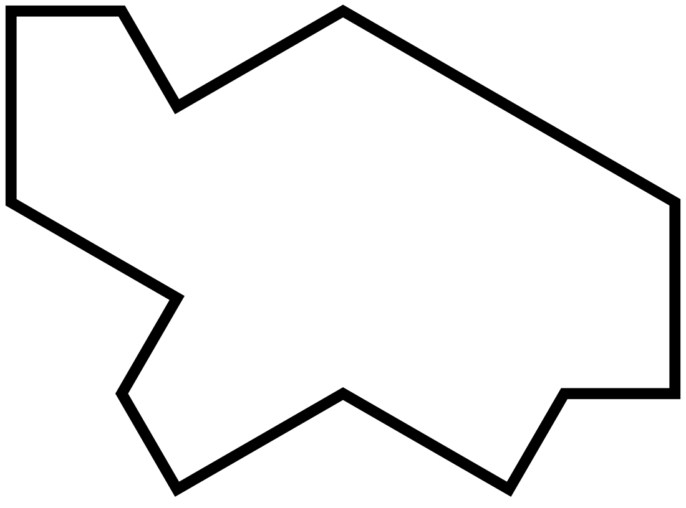

# The aperiodic monotile in a variety of formats

This repository contains code and vector image files to produce [the aperiodic monotiles found by David Smith, Joseph Samuel Myers, Craig S. Kaplan, and Chaim Goodman-Strauss](https://cs.uwaterloo.ca/~csk/hat/).

There are two monotiles, which each tile the plane aperiodically.

A 'hat':

And a 'turtle':

Each file produces a single copy of the tile. Several copies of the tile, with some flipped or mirrored, fit together to tile the plane.

The files are:

* [hat-monotile.svg](hat-monotile.svg) / [turtle-monotile.svg](turtle-monotile.svg) - A vector graphics file for use in programs such as Inkscape or Adobe Illustrator.
* [hat-monotile-kites.svg](hat-monotile-kites.svg) / [turtle-monotile-kites.svg](turtle-monotile-kites.svg) - A vector graphics file showing the construction of each tile from kites.
* [hat-monotile.scad](hat-monotile.scad) / [turtle-monotile.scad](turtle-monotile.scad) - Code to produce the tile in [OpenSCAD](https://openscad.org/), for 3D printing.
* [hat-monotile.stl](hat-monotile.stl) / [turtle-monotile.stl](turtle-monotile.stl) - An STL file produced using the OpenSCAD code, which can be sent directly to a 3D printer, or manipulated in other 3D software.
* [hat-monotile.logo](hat-monotile.logo) / [turtle-monotile.logo](turtle-monotile.logo) - A LOGO script to draw the outline of the title with Turtle graphics.
